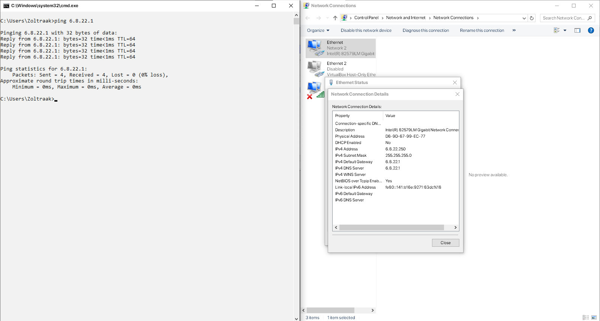
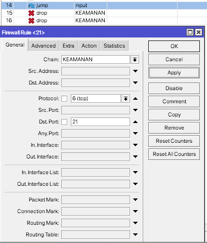

# LAB-44-Firewall-Filter-Rules
Senin 25 Agustus 2025  
  
# Filter Rules
  
# Chain  
  Chain adalah alur trafik yang sedang diproses, ada 3 chain default di Mikrotik dan kita juga bisa custom chain.   
  1. Input  
       Untuk trafik menuju router itu sendiri. Contoh, SSH ke Souter, Winbox, ping router, update NTP. Jika ingin mengamankan router, filternya ada di sini.  
  2. Forward  
       Untuk trafik yang melewati router, dari satu interface ke interface lain. Contoh, PC A di LAN ping ke google lalu paketnya melewati router dan di proses di forward.  
  3. Output  
       Untuk trafik yang berasal dari luar router. Contoh, router ping ke 8.8.8.8, update NTP, DNS query.  
  4. Custom chain  
       Dibuat manual dengan terget **jump-target**, berguna kalau aturan terlalu panjang jadi bisa dipisah, kalau rule di custom chain selesai, paket otomatis return ke chain asal. Custom chain bukan alur trafik baru, tapi sub chain yang dibuat untuk mengelompokan rule, lalu dipanggil lewat *jump*.  
  
# Action  
  1. accept    
       Paket diizinkan lewat, tidak diperiksa lagi di chain itu. Biasanya dipakai untuk whitelist. Aturan accept diletakan sebelum rule drop.  
     Contoh penggunaan:  
       Disini saya akan mengizinkan hanya ip 6.8.22.254 yang bisa login ke winbox.  
  
  
  
  
  2. drop  
       Paket dibuang diam-diam, pengirim tidak diberi tau.  
     Contoh penggunaan:  
       Disini saya akan membuat agar hanya ip 6.8.22.254 yang tidak bisa melakukan ping ke Mikrotik.  
  
  
  
  3. reject  
       Sama seperti drop, tapi pengirim diberi tau.  
     Contoh Penggunaan:  
       Disini saya akan membuat agar ether2 tidak bisa ping ke Mikrotik.  
  

  
  5. jump  
       untuk lompat ke chain tertentu, setelah selesai di chain custom, jika tidak ada return, akan otomatis kembali ke chain asal.  
     Contoh Penggunaan:  
       Disini saya akan membuat filter rules, drop port Telnet dan FTP dan drop ping flood. Kalau semua ditaruh di chain input, rule akan penjang dan berantakan, solusinya bikin custom chain.  
  
       Artinya semua trafik masuk akan lompat ke chain baru bernama *KEAMANAN*, selanjutnya.    
  
  
  
  
  
  
      Pengujian  
  
  
  
  7. return  
       Kembali ke chain asal lebih awal, tidak menunggu sampai akhir custom chain.  
     Contoh penggunaan:  
       Disini saya akan menambahkan return di tengah-tengah rule-rule custom chain yang sebelumnya di jump.  
  
       Setelah return, paket balik ke chain input, lalu diterusin baca rule berikutnya setelah jump.  
  9. passthrough  
       Jika rule tidak match, paket langsung berhenti di rule itu.  
     Contoh Penggunaan:  
  
  
  
  11. tarpit  
       Menjebak koneksi TCP agar macet dan membuat penyerang membuang-buang waktu. Cocok untuk menahan brute force dengan jumlah yang tidak besar. Bisa memakan resource jika dipakai berlebihan akan banyak koneksi tertahan.  
      Contoh Penggunaan:  
      Disini saya akan membekukan akses ke SSH, Telnet dan webfig.  
  
  
  13. fasttrack-connection  
        Fitur untuk mempercepat proses forward paket di Mikrotik. Biasanya paket masuk dicek semua oleh firewall filter, NAT, Mangle. Kalau connection fasttrack, paket selanjutnya langsung dilewatkn tanpa di periksa lagi (kecuali paket pertama).  
      Contoh Penggunaan:  
        Misalnya mau mempercepat trafik dari LAN ke Internet.  
  
  
  
  
        Pengujiannya  

          tool profile
      CPU usage akan lebih rendah dibanding tanpa FastTrack.  
  15. log  
        Mencatat paket ke log. Cocok untuk debug, audit, mengamati rule nyala atau tidak. selain mengunakan action **log**, bisa juga menyalakan logging di action apapun dengan centang **log=yes**.  
      Contoh menggunaan:  
        Misalnya saya disini ingin melihat siapa aja yang coba akses port Telnet ke router.   
  
  
  
  17. add-src-to-address-list  
        IP sumber paket yang match dengan rule ini akan ditambahkan ke address list.  Biasanya blacklist otomatis, IP yang gagal login ke SSH dalam berapa kali masuk ke blacklist.  
      Contoh Penggunaan:  
        Disini saya mau agar IP yang mengakses Telnet otomatis masuk ke address list.  
  
  
  
  
  19. add-dst-to-address-list  
        IP tujuan paket yang match akan dimasukan ke address list. Biasanya dipakai untuk tracking koneksi luar, contoh, client yang mengakses server tertentu, misalnya IP tujuan Facebook dimasukan ke list).  
      Contoh Penggunaan:  
        Contoh kita mau mencatat IP tujuan yang diakses klien.  
  
  
  
  
  
# Kesimpulan
  Firewall filter di Mikrotik dipakai untuk menyaring traffic dengan filter, kita bisa mengizinkan, memblokir atau memproses paket lebih lanjut sesuai kebutuhan.  
